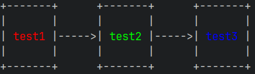

# Mermaid ASCII

Render mermaid diagrams in your terminal:

## Installation

You can download the binary from Github releases:

```bash
# Get the latest release
$ curl -s https://api.github.com/repos/AlexanderGrooff/mermaid-ascii/releases/latest | grep "browser_download_url.*mermaid-ascii" | grep "$(uname)_$(uname -m)" | cut -d: -f2,3 | tr -d \" | wget -qi -
# Unzip it
$ tar xvzf mermaid-ascii_*.tar.gz
$ ./mermaid-ascii --help
```

You can also build it yourself:

```bash
$ git clone
$ cd mermaid-ascii
$ go build
$ mermaid-ascii --help
```

Or using Nix:
```bash
$ git clone
$ cd mermaid-ascii
$ nix build
$ ./result/bin/mermaid-ascii --help
```

## Usage

You can render graphs directly from the command line or start a web interface to render them interactively.

```bash
$ cat test.mermaid
graph LR
A --> B & C
B --> C & D
D --> C
$ mermaid-ascii --file test.mermaid
┌───┐     ┌───┐     ┌───┐
│   │     │   │     │   │
│ A ├────►│ B ├────►│ D │
│   │     │   │     │   │
└─┬─┘     └─┬─┘     └─┬─┘
  │         │         │  
  │         │         │  
  │         │         │  
  │         │         │  
  │         ▼         │  
  │       ┌───┐       │  
  │       │   │       │  
  └──────►│ C │◄──────┘  
          │   │          
          └───┘          

# Increase horizontal spacing
$ mermaid-ascii --file test.mermaid -x 8
┌───┐        ┌───┐        ┌───┐
│   │        │   │        │   │
│ A ├───────►│ B ├───────►│ D │
│   │        │   │        │   │
└─┬─┘        └─┬─┘        └─┬─┘
  │            │            │  
  │            │            │  
  │            │            │  
  │            │            │  
  │            ▼            │  
  │          ┌───┐          │  
  │          │   │          │  
  └─────────►│ C │◄─────────┘  
             │   │             
             └───┘             

# Increase box padding
$ mermaid-ascii -f ./test.mermaid -p 3
┌───────┐     ┌───────┐     ┌───────┐
│       │     │       │     │       │
│       │     │       │     │       │
│       │     │       │     │       │
│   A   ├────►│   B   ├────►│   D   │
│       │     │       │     │       │
│       │     │       │     │       │
│       │     │       │     │       │
└───┬───┘     └───┬───┘     └───┬───┘
    │             │             │
    │             │             │
    │             │             │
    │             │             │
    │             ▼             │
    │         ┌───────┐         │
    │         │       │         │
    │         │       │         │
    │         │       │         │
    └────────►│   C   │◄────────┘
              │       │
              │       │
              │       │
              └───────┘

# Labeled edges
$ cat test.mermaid
graph LR
A --> B
A --> C
B --> C
B -->|example| D
D --> C
$ mermaid-ascii -f ./test.mermaid
┌───┐     ┌───┐         ┌───┐
│   │     │   │         │   │
│ A ├────►│ B ├─example►│ D │
│   │     │   │         │   │
└─┬─┘     └─┬─┘         └─┬─┘
  │         │             │  
  │         │             │  
  │         │             │  
  │         │             │  
  │         ▼             │  
  │       ┌───┐           │  
  │       │   │           │  
  └──────►│ C │◄──────────┘  
          │   │              
          └───┘              

# Multi-line node labels
$ cat test.mermaid
graph LR
A["First<br/>Second"] --> B["Line 1<br>Line 2<br>Line 3"]
$ mermaid-ascii -f ./test.mermaid
┌────────┐     ┌────────┐
│ First  │     │ Line 1 │
│ Second ├────►│ Line 2 │
│        │     │ Line 3 │
└────────┘     └────────┘

# Control diagram width
$ cat test.mermaid
graph LR
A --> B --> C --> D --> E
$ mermaid-ascii -f ./test.mermaid -w 50
┌───┐     ┌───┐     ┌───┐
│   │     │   │     │   │
│ A ├────►│ B ├────►│ C │
│   │     │   │     │   │
└─┬─┘     └───┘     └───┘
  │                      
  │                      
  │                      
  │                      
  ▼                      
┌───┐     ┌───┐          
│   │     │   │          
│ D ├────►│ E │          
│   │     │   │          
└───┘     └───┘          

# Top-down layout
$ cat test.mermaid
graph TD
A --> B
A --> C
B --> C
B -->|example| D
D --> C
$ mermaid-ascii -f ./test.mermaid
┌─────────┐          
│         │          
│    A    ├───────┐  
│         │       │  
└────┬────┘       │  
     │            │  
     │            │  
     │            │  
     │            │  
     ▼            ▼  
┌─────────┐     ┌───┐
│         │     │   │
│    B    ├────►│ C │
│         │     │   │
└────┬────┘     └───┘
     │            ▲  
     │            │  
  example         │  
     │            │  
     ▼            │  
┌─────────┐       │  
│         │       │  
│    D    ├───────┘  
│         │          
└─────────┘          

# Read from stdin
$ cat test.mermaid | mermaid-ascii
┌───┐     ┌───┐     ┌───┐
│   │     │   │     │   │
│ A ├────►│ B ├────►│ D │
│   │     │   │     │   │
└─┬─┘     └─┬─┘     └─┬─┘
  │         │         │  
  │         │         │  
  │         │         │  
  │         │         │  
  │         ▼         │  
  │       ┌───┐       │  
  │       │   │       │  
  └──────►│ C │◄──────┘  
          │   │          
          └───┘          

# Only ASCII
$ cat test.mermaid | mermaid-ascii --ascii
+---+     +---+     +---+
|   |     |   |     |   |
| A |---->| B |---->| D |
|   |     |   |     |   |
+---+     +---+     +---+
  |         |         |
  |         |         |
  |         |         |
  |         |         |
  |         v         |
  |       +---+       |
  |       |   |       |
  ------->| C |<-------
          |   |
          +---+

# Using Docker
$ docker build -t mermaid-ascii .
$ echo 'sequenceDiagram
Alice->>Bob: Hello
Bob-->>Alice: Hi' | docker run -i mermaid-ascii -f -
┌───────┐     ┌─────┐
│ Alice │     │ Bob │
└───┬───┘     └──┬──┘
    │            │
    │ Hello      │
    ├───────────►│
    │            │
    │ Hi         │
    │◄┈┈┈┈┈┈┈┈┈┈┈┤
    │            │

# Graph diagrams work too
$ echo 'graph LR
A-->B-->C' | docker run -i mermaid-ascii -f -
┌───┐     ┌───┐     ┌───┐
│   │     │   │     │   │
│ A ├────►│ B ├────►│ C │
│   │     │   │     │   │
└───┘     └───┘     └───┘

# Run web interface
$ docker run -p 3001:3001 mermaid-ascii web --port 3001
# Then visit http://localhost:3001
```

### Sequence Diagrams

Sequence diagrams are also fully supported! They visualize message flows between participants over time.

```bash
# Simple sequence diagram
$ cat sequence.mermaid
sequenceDiagram
Alice->>Bob: Hello Bob!
Bob-->>Alice: Hi Alice!
$ mermaid-ascii -f sequence.mermaid
┌───────┐     ┌─────┐
│ Alice │     │ Bob │
└───┬───┘     └──┬──┘
    │            │
    │ Hello Bob! │
    ├───────────►│
    │            │
    │ Hi Alice!  │
    │◄┈┈┈┈┈┈┈┈┈┈┈┤
    │            │

# Solid arrows (->>) and dotted arrows (-->>)
$ cat sequence.mermaid
sequenceDiagram
Client->>Server: Request
Server-->>Client: Response
$ mermaid-ascii -f sequence.mermaid
┌────────┐     ┌────────┐
│ Client │     │ Server │
└───┬────┘     └───┬────┘
    │              │
    │   Request    │
    ├─────────────►│
    │              │
    │   Response   │
    │◄┈┈┈┈┈┈┈┈┈┈┈┈┈┤
    │              │

# Multiple participants
$ cat sequence.mermaid
sequenceDiagram
Alice->>Bob: Hello!
Bob->>Charlie: Forward message
Charlie-->>Alice: Got it!
$ mermaid-ascii -f sequence.mermaid
┌───────┐     ┌─────┐     ┌─────────┐
│ Alice │     │ Bob │     │ Charlie │
└───┬───┘     └──┬──┘     └────┬────┘
    │            │              │
    │   Hello!   │              │
    ├───────────►│              │
    │            │              │
    │            │ Forward message
    │            ├─────────────►│
    │            │              │
    │         Got it!           │
    │◄┈┈┈┈┈┈┈┈┈┈┈┈┈┈┈┈┈┈┈┈┈┈┈┈┈┈┤
    │            │              │

# Self-messages
$ cat sequence.mermaid
sequenceDiagram
Alice->>Alice: Think
Alice->>Bob: Hello
$ mermaid-ascii -f sequence.mermaid
┌───────┐     ┌─────┐
│ Alice │     │ Bob │
└───┬───┘     └──┬──┘
    │            │
    │ Think      │
    ├──┐         │
    │  │         │
    │◄─┘         │
    │            │
    │ Hello      │
    ├───────────►│
    │            │

# Explicit participant declarations with aliases
$ cat sequence.mermaid
sequenceDiagram
participant A as Alice
participant B as Bob
A->>B: Message from Alice
B-->>A: Reply to Alice
$ mermaid-ascii -f sequence.mermaid
┌───────┐     ┌─────┐
│ Alice │     │ Bob │
└───┬───┘     └──┬──┘
    │            │
    │ Message from Alice
    ├───────────►│
    │            │
    │ Reply to Alice
    │◄┈┈┈┈┈┈┈┈┈┈┈┤
    │            │

# ASCII mode for sequence diagrams
$ cat sequence.mermaid | mermaid-ascii --ascii
+-------+     +-----+
| Alice |     | Bob |
+---+---+     +--+--+
    |            |
    | Hello Bob! |
    +----------->|
    |            |
    | Hi Alice!  |
    |<...........+
    |            |

```

```bash
$ mermaid-ascii --help
Generate ASCII diagrams from mermaid code.

Usage:
  mermaid-ascii [flags]
  mermaid-ascii [command]

Available Commands:
  completion  Generate the autocompletion script for the specified shell
  help        Help about any command
  web         HTTP server for rendering mermaid diagrams.

Flags:
  -a, --ascii               Don't use extended character set
  -p, --borderPadding int   Padding between text and border (default 1)
  -c, --coords              Show coordinates
  -f, --file string         Mermaid file to parse (use '-' for stdin)
      --fit                 Force automatic fitting even without width constraint
  -h, --help                help for mermaid-ascii
  -w, --maxWidth int        Maximum diagram width in characters (0 = unlimited)
  -x, --paddingX int        Horizontal space between nodes (default 5)
  -y, --paddingY int        Vertical space between nodes (default 5)
  -v, --verbose             Verbose output

Use "mermaid-ascii [command] --help" for more information about a command.

# And some ridiculous example
$ mermaid-ascii -f complex.mermaid
┌───┐     ┌───┐     ┌───┐     ┌───┐     ┌───┐     ┌───┐
│   │     │   │     │   │     │   │     │   │     │   │
│ A ├────►│ B ├──┬─►│ E ├──┬─►│ M ├──┬─►│ U ├──┬─►│ W │
│   │     │   │  │  │   │  │  │   │  │  │   │  │  │   │
└─┬─┘     └─┬─┘  │  └─┬─┘  │  └─┬─┘  │  └─┬─┘  │  └─┬─┘
  │         │    │    │    │    │    │    ▲    │    │  
  │         │    │    │    │    │    │    │    │    │  
  │    ┌────┘    ├────┘    │    ├────┘    ├────┼────┘  
  │    │         │         │    │         │    │       
  │    │         │         │    ▼         ▼    │       
  │    │  ┌───┐  │  ┌───┐  │  ┌─┴─┐     ┌───┐  │  ┌───┐
  │    │  │   │  │  │   │  │  │   │     │   │  │  │   │
  ├────┼─►│ C ├──┼─►│ F │  ├─►│ Q ├────►│ Y │◄─┼─►│ V │
  │    │  │   │  │  │   │  │  │   │     │   │  │  │   │
  │    │  └─┬─┘  │  └─┬─┘  │  └───┘     └───┘  │  └─┬─┘
  │    │    │    │    │    │                   │    ▲  
  │    │    │    │    │    │                   │    │  
  │    └────┼────┤    └────┤                   │    │  
  │         │    │         │                   │    │  
  │         ▼    │         │                   │    │  
  │       ┌─┴─┐  │  ┌───┐  │  ┌───┐     ┌───┐  │    │  
  │       │   │  │  │   │  │  │   │     │   │  │    │  
  └──────►│ D │  ├─►│ G │  ├─►│ L ├──┬─►│ T ├──┼────┤  
          │   │  │  │   │  │  │   │  │  │   │  │    │  
          └─┬─┘  │  └─┬─┘  │  └─┬─┘  │  └─┬─┘  │    │  
            │    │    │    │    │    │    ▲    │    │  
            │    │    │    │    │    │    │    │    │  
            │    │    ├────┼────┘    │    ├────┤    │  
            │    │    │    │         │    │    │    │  
            │    │    ▼    │         │    ▼    │    │  
            │    │  ┌─┴─┐  │  ┌───┐  │  ┌───┐  │    │  
            │    │  │   │  │  │   │  │  │   │  │    │  
            │    ├─►│ H │  ├─►│ J │  ├─►│ X │◄─┼────┤  
            │    │  │   │  │  │   │  │  │   │  │    │  
            │    │  └─┬─┘  │  └─┬─┘  │  └───┘  │    │  
            │    │    │    │    │    │         │    │  
            │    │    │    │    │    │         │    │  
            │    └────┼────┤    └────┤    ┌────┤    │  
            │         │    │         │    │    │    │  
            │         ▼    │         │    │    │    │  
            │       ┌─┴─┐  │  ┌───┐  │  ┌─┴─┐  │    │  
            │       │   │  │  │   │  │  │   │  │    │  
            └──────►│ I │  ├─►│ K │  ├─►│ R ├──┼────┘  
                    │   │  │  │   │  │  │   │  │       
                    └───┘  │  └─┬─┘  │  └───┘  │       
                           │    │    │         │       
                           │    │    │         │       
                           │    ├────┼────┬────┤       
                           │    │    │    │    │       
                           │    ▼    │    │    │       
                           │  ┌─┴─┐  │  ┌─┴─┐  │       
                           │  │   │  │  │   │  │       
                           ├─►│ N │  ├─►│ O │  │       
                           │  │   │  │  │   │  │       
                           │  └───┘  │  └─┬─┘  │       
                           │         │    │    │       
                           │         │    │    │       
                           ├────┬────┤    ├────┘       
                           │    │    │    │            
                           │    ▼    │    ▼            
                           │  ┌─┴─┐  │  ┌─┴─┐          
                           │  │   │  │  │   │          
                           └─►│ P │  └─►│ S │          
                              │   │     │   │          
                              └───┘     └───┘          

```

Colored output is also supported (given that your terminal supports it) using the `classDef` syntax:

```bash
graph LR
classDef example1 color:#ff0000
classDef example2 color:#00ff00
classDef example3 color:#0000ff
test1:::example1 --> test2
test2:::example2 --> test3:::example3
```

This results in the following graph:



## How it works

We parse a mermaid file into basic components in order to render a grid. The grid is used for mapping purposes, which is eventually converted to a drawing.
The grid looks a bit like this:

```
There are three grid-points per node, and one in-between nodes.
These coords don't have to be the same size, as long as they
can be used for pathing purposes where we convert them to drawing
coordinates.
This allows us to navigate edges between nodes, like the arrow in this
drawing taking the path [(2,1), (3,1), (3,5), (4,5)].
    0      1      2  3  4      5      6
    |      |      |  |  |      |      |
    v      v      v  v  v      v      v
                                       
0-> +-------------+     +-------------+
    |             |     |             |
1-> |  Some text  |---  |  Some text  |
    |             |  |  |             |
2-> +-------------+  |  +-------------+
                     |                 
3->                  |                 
                     |                 
4-> +-------------+  |  +-------------+
    |             |  |  |             |
5-> |  Some text  |  -->|  Some text  |
    |             |     |             |
6-> +-------------+     +-------------+
```

You can show these coords in your graph by enabling the `--coords` flag:

```bash
$ mermaid-ascii -f ./test.mermaid --coords
   01  23    45  67  89       0
   0123456789012345678901234567
0 0+---+     +---+   +--------+
  1|   |     |   |   |        |
1 2| A |-123>| B |-->|   D    |
  3|   |     |   |   |        |
2 4+---+     +---+   +--------+
  5  |         |          |
3 6  |         2          |
  7  |         v       123456
4 8  |       +---+        |
  9  |       |   |        |
510  ------->| C |<--------
 11          |   |
612          +---+
```

Note that with `--coords` enabled, the grid-coords shown show the starting location of the coord, not the center of the coord. This is why `(1,0)` is next to `(0,0)` instead of in the center of the `A` node.

## Supported Diagram Types

### Graphs / Flowcharts ✅
- [x] Graph directions (`graph LR` and `graph TD`)
- [x] Labelled edges (like `A -->|label| B`)
- [x] Multi-line node labels (using `<br/>` or `<br>` tags)
- [x] Multiple arrows on one line (like `A --> B --> C`)
- [x] `A & B` syntax
- [x] `classDef` and `class` for colored output
- [x] Prevent arrows overlapping nodes
- [x] Control diagram width (via `-w/--maxWidth` flag)
- [ ] `subgraph` support
- [ ] Shapes other than rectangles
- [ ] Diagonal arrows

### Sequence Diagrams ✅
- [x] Basic message syntax (`A->>B: message`)
- [x] Solid arrows (`->>`) and dotted arrows (`-->>`)
- [x] Self-messages (`A->>A: think`)
- [x] Participant declarations (`participant Alice`)
- [x] Participant aliases (`participant A as Alice`)
- [x] Unicode support (emojis, CJK characters, etc.)
- [x] Both ASCII and Unicode rendering modes
- [ ] Activation boxes
- [ ] Notes (`Note left of Alice: text`)
- [ ] Loops, alt, opt blocks

## TODOs

The baseline components for Mermaid work, but there are a lot of things that are not supported yet. Here's a list of things that are not yet supported:

### Syntax support

- [x] Labelled edges (like `A -->|label| B`)
- [x] Graph directions like `graph LR` and `graph TD`
- [x] `classDef` and `class`
- [x] `A & B`
- [x] Multiple arrows on one line (like `A --> B --> C`)
- [ ] `subgraph`
- [ ] Shapes other than rectangles
- [ ] Whitespacing and comments

### Rendering

- [x] Prevent arrows overlapping nodes
- [x] Control maximum diagram width (via `-w/--maxWidth` flag)
- [ ] Diagonal arrows
- [ ] Place nodes in a more compact way

### Sequence Diagram Improvements

- [ ] Activation boxes (activate/deactivate)
- [ ] Notes (`Note left of Alice: text`)
- [ ] Loops, alt, opt, and par blocks

### General

- [ ] Support for more diagram types (class diagrams, state diagrams, etc.)
